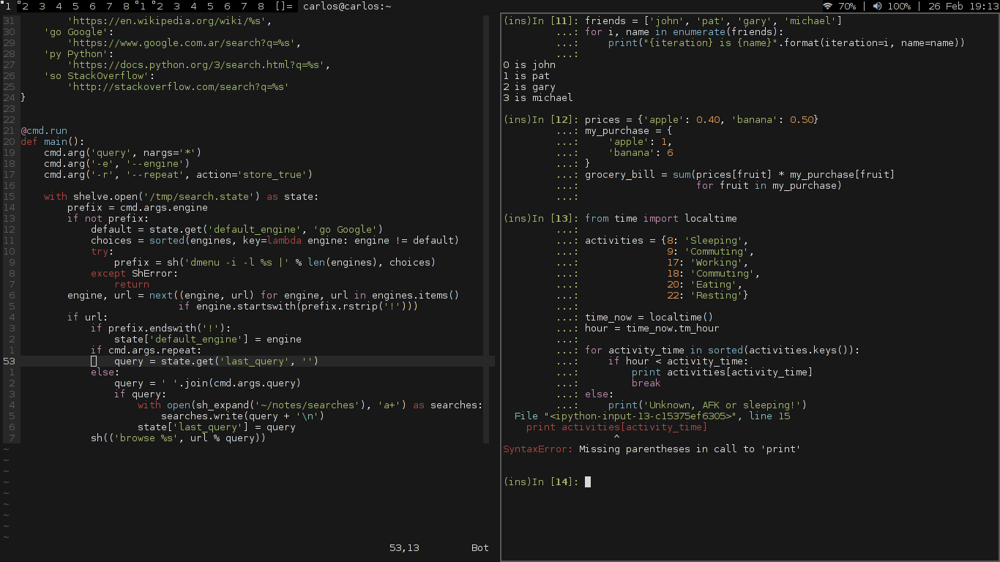

# Base16 for [prompt-toolkit](https://github.com/jonathanslenders/python-prompt-toolkit) (and [ipython](https://ipython.org/)!)

Clone and pip install this, or put it somewhere such that the directory `base16`
is in (or at least is symlinked from) your `PYTHONPATH`.

Then import your preferred theme using `importlib`:

```python
theme = importlib.import_module('base16.base16-default-dark')
```

Here is a complete example that configures ipython with `default-dark`:

```python
theme = importlib.import_module('base16.base16-default-dark')
c.TerminalInteractiveShell.highlighting_style = theme.Base16Style
c.TerminalInteractiveShell.highlighting_style_overrides = theme.overrides
```

This is how it looks side-to-side with vim base16:



I strived to make prompt-toolkit themes resemble vim themes as much as possible,
but not all syntax categories of vim are present in prompt-toolkit.

That's it!
